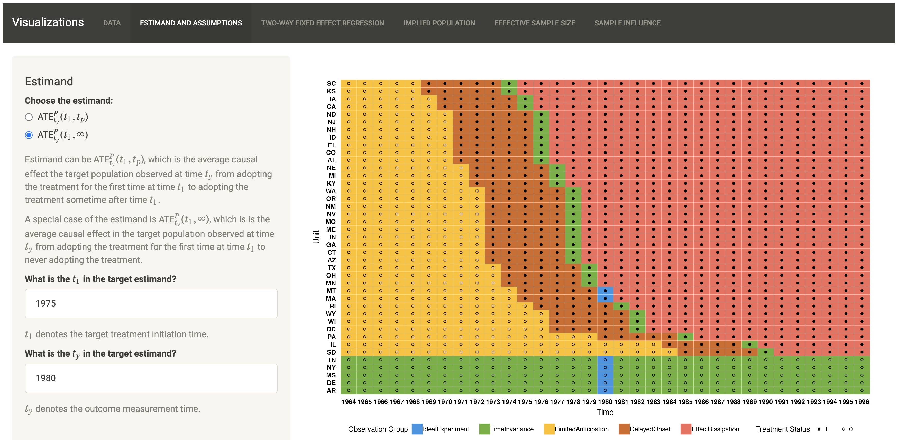
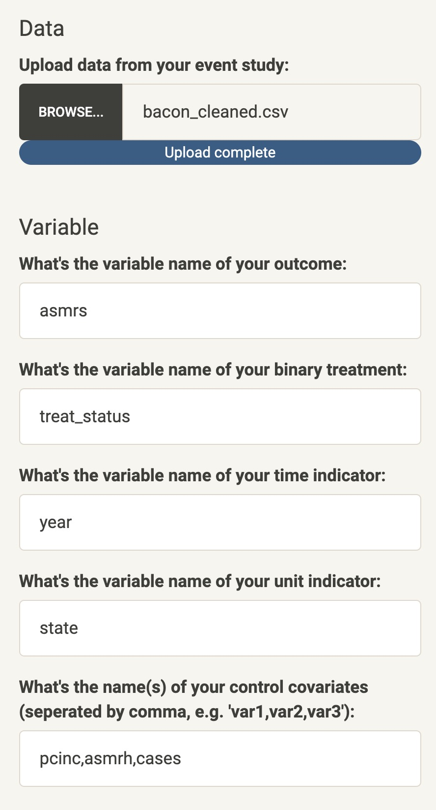

Visualizing Event Studies
================

Here you’ll find a visualization tool designed for researchers
interested in analyzing event studies. This tool allows users to define
their estimands, impose their assumptions, and select valid observations
for analysis in their datasets. Additionally, the platform includes a
suite of weighting diagnostics, describing the implied weighted
populations, group-wise effective sample size (ESS), information
contributions of observation groups, and influence of individual
observations on the estimator. This visualization tool aims to enhance
the transparency of event study analyses and empower researchers to make
well-informed decisions in their analysis.



------------------------------------------------------------------------

## Table of Contents

1.  [Introduction](#introduction)
2.  [Features](#features)
3.  [Installation](#installation)
4.  [Contributing](#contributing)
5.  [License](#license)

------------------------------------------------------------------------

## Introduction

This platform is an interactive visualization tool for researchers
working on event studies. It enables users to:

- For a given dataset of event studies with staggered intervention,
  implement the classical dynamic TWFE regression estimator and a
  proposed robust weighting estimator developed in our recent
  [paper](https://arxiv.org/pdf/2410.17399).

- Perform diagnostics to visualize and understand the implied target
  population, analyze effective sample size (ESS) and information
  borrowing.

The platform is based on `R` and `Shiny` to offer real-time interaction,
allowing users to dynamically adjust parameters and observe results.

------------------------------------------------------------------------

## Features

1.  **Customizable Parameters**: import your dataset (e.g., CSV files)
    for analysis, specify in the dataset the variable name corresponding
    to the outcome, the binary treatment, the unit of analysis (e.g.,
    country, state, county), and the time (e.g., year, quarter, month).
    *Note: we will not keep a copy of your dataset. All the interactive
    analysis can be conducted locally.*



2.  **Interactive Visualizations**: we provide the following
    visualizations to guide you through the analysis of event studies.

3.  **Real-Time Data Analysis and Diagnostics**:

4.  **Downloadable Results**: You will have the option to download the
    diagnostic measures.

------------------------------------------------------------------------

## Installation

To run this software locally, ensure that you have R and the required
packages installed.

### Prerequisites

- R (version \>= 4.0)

- RStudio

- Shiny package: Install using `install.packages("shiny")`

- Required R packages for analysis including:

  - 

### Steps

1.  Clone this repository:

``` bash
git clone https://github.com/zhushen3128/EventStudy.git
cd EventStudy
```

2.  Open `app.R` in RStudio. Remember to save the `util.R` file in the
    same directory.

3.  Run the app using:

``` r
library(shiny)
runApp('app.R')
```

### Usage

- Start the Application: Run the Shiny app as described above.

- Upload Data: Import datasets (e.g., CSV files) for analysis. In the
  GitHub repository, we provide a sample dataset named
  `bacon_cleaned.cvs` which is used as the default dataset for the tool.

- Explore Features: Use the interactive controls to adjust assumptions,
  modify parameters, and visualize outcomes.

- Export Results: Save plots and analysis outputs for reporting.

------------------------------------------------------------------------

## Contributing

We welcome contributions to improve this platform! To contribute:

- Fork this repository.

- Create a new branch:

``` bash
git checkout -b feature-name
```

- Commit your changes and submit a pull request.

------------------------------------------------------------------------

## License

This project is licensed under the MIT License.
